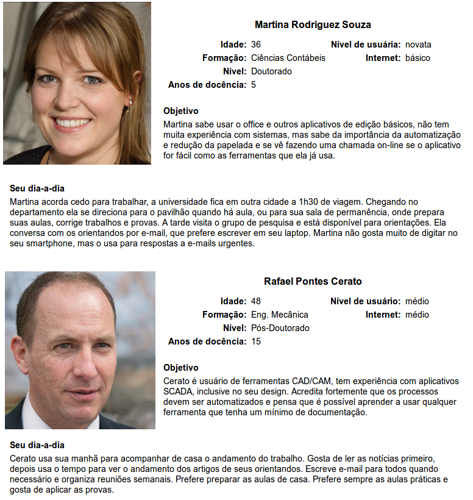

# Personas, Use Cases, Tasks e Scenarios

## Personas

A descrição de um usuário fictício que se encaixa no público-alvo, seu nicho, cultura, estilo de vida, faixa etária, etc. 

São abstrações de usuários reais que compartilham características e necessidades em comum.

Objetivo principal: **ajudar a visualizar o usuário real do sistema**!

Quatro perspectivas:

- Goal-directed: não identificar uma pessoa mediana, mas justamente uma pessoa particular com detalhes e uma **meta** bem definida;
- Role-based: dar ênfase aos seus **papéis**, gerando vários tipos de personas baseando-se nos dados coletados;
- Engaging: usar estórias para produzir envolvimento, deixando de ser apenas um estereótipo distante para alguém com quem se importar;
- Fiction-based: de uso exploratório são geralmente usadas para discussão. São criadas a partir da intuição dos(as) _designers_, sendo também conhecido como _ad hoc_.

Exemplo:

Considerar um aplicativo para chamada _on-line_. Quem são as _personas_?

## Use Cases

Também conhecidos como estórias de usuários, são narrativas inspiracionais do uso do app, de um modo que reuna o **usuário**, sua **necessidade** e um **app/design** de como deve acontecer. 

Podem ser construídos sobre as personas, sobre os dados da pesquisa do usuário, ou pode ser antes de tudo para delinear a visão do app.

Exemplo:

_Vanessa é professora no curso de Ciência da Computação e não entendia o porquê do caderno de chamada ser no papel. Ela soube que a TI da universidade estava disponibilizando o caderno de chamada on-line de forma experimental e decidiu se inscrever como usuária beta. Vanessa usou a chamada on-line em todo o semestre nas suas três turmas. Ela abria o navegador, acessava a página de sistemas da universidade e se logava. Suas turmas apareciam na sua tela inicial, onde ela acionava a opção realizar a chamada. O aplicativo mostrava cada estudante com a opção de assinalar presença ou falta. Vanessa, então, tem o controle exato do calendário e dias de aula, seus alunos sabem sua frequência pelo mesmo sistema e estão contentes com a transparência._

A narrativa deve relatar um caso de uso no futuro, que seja motivacional e reflita principalmente **o porquê de estamos desenvolvimento isso**.

## Task && Scenarios

Uma _task_ (tarefa) é uma descrição clara de uma funcionalidade completa que um usuário específico queira realizar.

Exemplo:

_O professor Pedro estava lendo um e-mail de um aluno no seu smartphone. O estudante notou que estava com menos de 70% de frequência e envio para o professor a data do único dia que faltou. Então, o professor Pedro precisou checar as chamadas para corrigir tais inconsistências._

Importante, **a descrição não diz exatamente _como_ ela será concluída**.

O detalhamento é feito com um _scenario_ (cenário), que descreve uma utilização do sistema para cumprir uma _task_ específica, detalhando a interface e as interações com esta em detalhes.

Exemplo:

_Pedro abre o sistema acadêmico instalado em seu smartphone. Na tela inicial toca na turma do estudante e depois em visualizar chamada. Ele rola a tela e ajusta o zoom, observando o quadro geral Pedro percebe que realmente existem faltas a mais. Para ajustar, pedro toca na linha do estudante em questão. Compara então a data recebida no e-mail do estudante com as exibidas no sistema marcadas como falta. Resolve alterar todas as datas para presença, exceto a data que o estudante realmente faltou e salva essas informações._

A partir dos cenários é possível (e recomendado) prototipar uma interface.

## Exercício

Considere um aplicativo para ...

Construa uma persona _ad hoc_, descreva pelo menos um _use case_, uma _task_ e seu _scenario_.